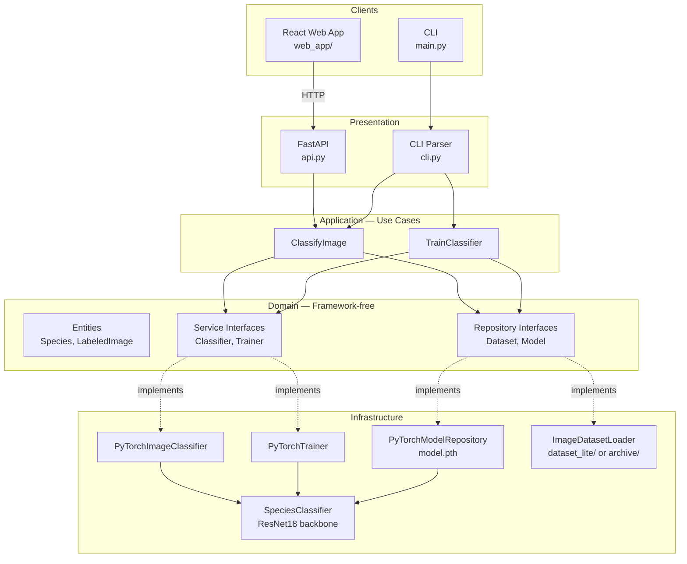
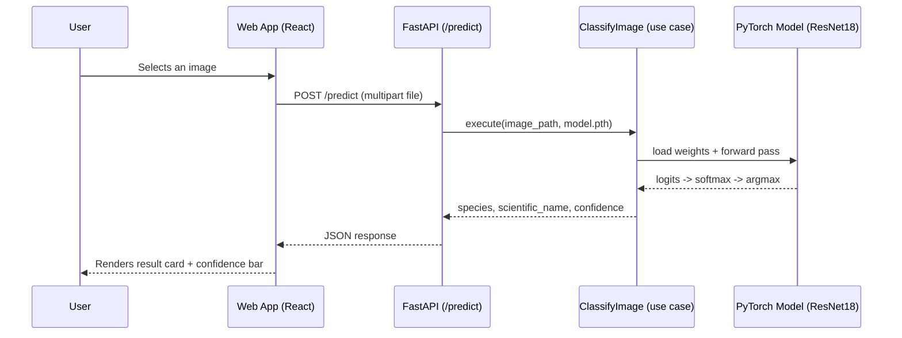
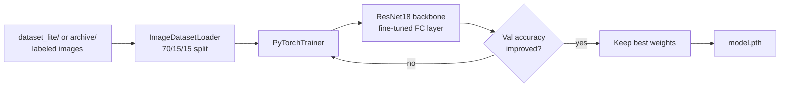
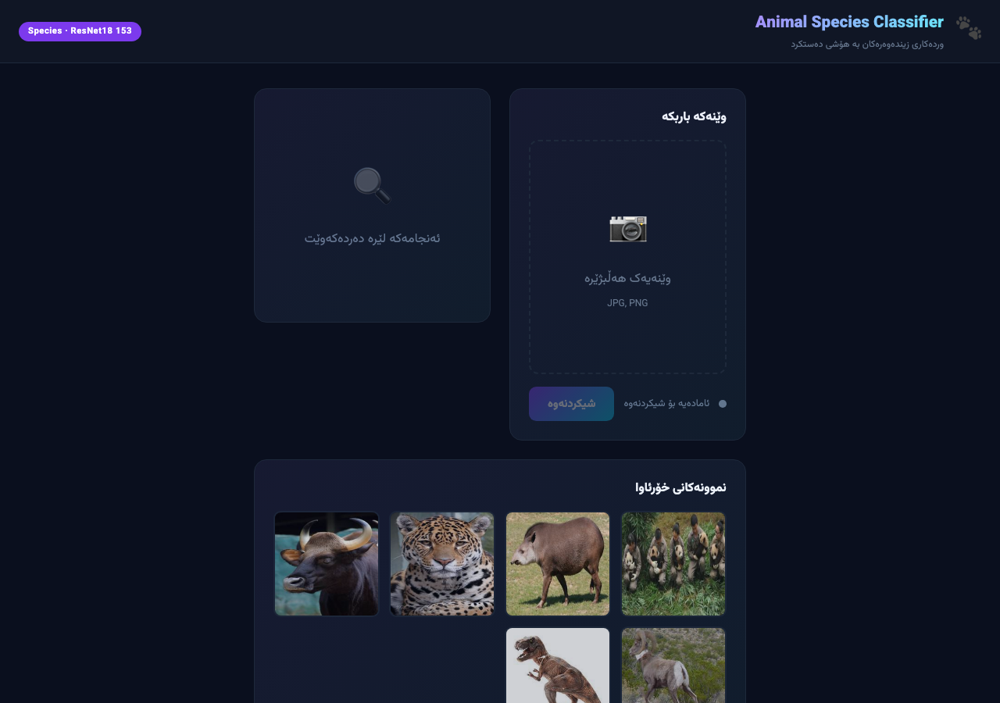
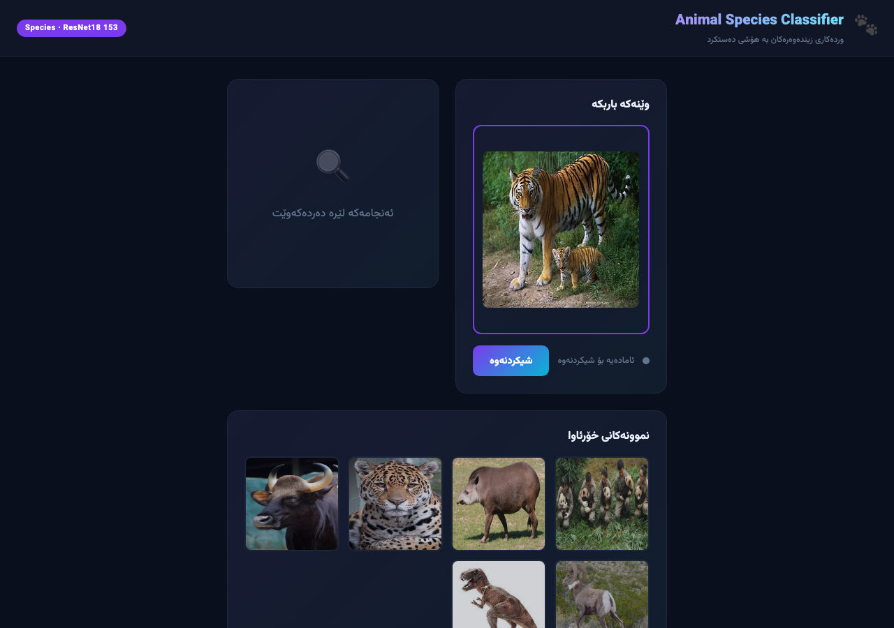
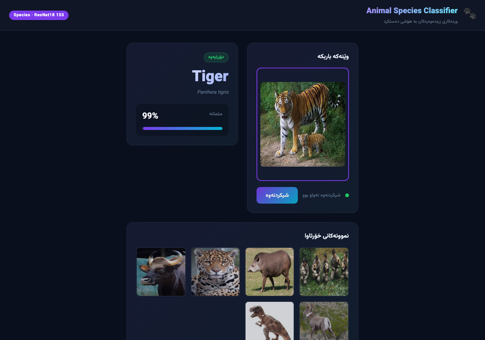

# Animal Species Image Classification

Upload a photo of an animal → get its species predicted by a ResNet18 CNN, with confidence score and live example images — via a CLI, a REST API, or a web app.

## Architecture

Clean/hexagonal architecture: the domain layer has no framework dependencies, and PyTorch/FastAPI/React are swappable infrastructure details.



**Layers**

| Layer | Folder | Responsibility |
|---|---|---|
| Presentation | `animal_classifier/presentation/` | FastAPI routes (`api.py`) and CLI commands (`cli.py`) |
| Application | `animal_classifier/application/` | Use cases: `ClassifyImage`, `TrainClassifier` |
| Domain | `animal_classifier/domain/` | `Species`/`LabeledImage` entities and repository/service interfaces — no PyTorch or FastAPI imports |
| Infrastructure | `animal_classifier/infrastructure/` | PyTorch model, trainer, predictor, and disk-based persistence implementing the domain interfaces |
| Web App | `web_app/` | React + Vite frontend that talks to the FastAPI backend over HTTP |

## System Workflow

**Inference (what happens on a prediction request)**



**Training pipeline**



1. Images are loaded per-species from `dataset_lite/` (bundled sample set) or `archive/` (full dataset, kept out of git via `.gitignore`).
2. Data is split 70% train / 15% validation / 15% test with a fixed random seed for reproducibility.
3. A ResNet18 pretrained on ImageNet has its final layer replaced with a `Linear(512, NUM_CLASSES)` head and is fine-tuned end-to-end with SGD + cross-entropy loss.
4. The checkpoint with the best validation accuracy is kept and saved to `model.pth`.
5. Inference reuses the exact same preprocessing (`Resize(224,224)` + ImageNet normalization) so training and serving stay consistent.

## Tech Stack

- **ML / Backend:** PyTorch, torchvision (ResNet18 transfer learning), FastAPI, Uvicorn
- **Frontend:** React 19, Vite, Tailwind CSS
- **Deployment:** Docker, Render (`render.yaml`), or a plain systemd service — see [DEPLOYMENT.md](DEPLOYMENT.md)

## Project Structure

```
Animal-species-image-classification/
├── animal_classifier/
│   ├── presentation/          # api.py (FastAPI), cli.py (train/predict commands)
│   ├── application/
│   │   ├── use_cases/         # ClassifyImage, TrainClassifier
│   │   └── dto/                # ClassificationResult
│   ├── domain/
│   │   ├── entities/           # Species, LabeledImage
│   │   ├── repositories/       # DatasetRepository, ModelRepository (interfaces)
│   │   └── services/            # Classifier, Trainer (interfaces)
│   ├── infrastructure/
│   │   ├── models/              # SpeciesClassifier (ResNet18)
│   │   ├── trainers/             # PyTorchTrainer
│   │   ├── predictors/            # PyTorchImageClassifier
│   │   └── persistence/            # PyTorchModelRepository (model.pth I/O)
│   ├── data/loaders/             # ImageDatasetLoader
│   └── config/settings.py          # image size, batch size, class count, paths
├── web_app/                        # React + Vite frontend
│   └── src/
│       ├── components/               # Header, UploadCard, ResultCard, Gallery
│       └── hooks/useClassifier.js      # API calls + upload/result state
├── dataset_lite/                     # Small bundled sample dataset (for demos & Render)
├── main.py                           # CLI entrypoint
├── run_api.py                        # API entrypoint (uvicorn)
├── model.pth                         # Trained weights
└── render.yaml / DEPLOYMENT.md       # Deployment configs
```

## Quick Start

### 1. Backend (API)

```bash
git clone https://github.com/mohammed-qader12/Animal-species-image-classification.git
cd Animal-species-image-classification

python -m venv .venv
source .venv/bin/activate   # Windows: .venv\Scripts\activate

pip install -r requirements.txt
python run_api.py
```

The API runs at `http://localhost:8000` (interactive docs at `http://localhost:8000/docs`).

### 2. Web App (in a new terminal)

```bash
cd web_app
npm install
npm run dev
```

The web app runs at `http://localhost:5173` and calls the API at `http://localhost:8000` by default (override with a `VITE_API_URL` env var in `web_app/.env`).

### 3. CLI (optional, no server needed)

```bash
# Classify a single image
python main.py predict path/to/photo.jpg

# Retrain the model
python main.py train --epochs 10 --output model.pth
```

## API Reference

### `POST /predict`
Classify an uploaded image.

```bash
curl -X POST http://localhost:8000/predict \
  -F "file=@photo.jpg"
```

```json
{
  "species": "Tiger",
  "scientific_name": "Panthera tigris",
  "confidence": 0.99
}
```

### `GET /examples?species=panthera-tigris&limit=6`
Random sample images for a species (or across all species if `species` is omitted) — used to populate the gallery.

### `GET /`
Health check — `{"message": "Animal Species Classifier API is running"}`

## Screenshots

**Home — upload panel and example gallery**


**Image selected, ready to analyze**


**Prediction result**


## Deployment

See [DEPLOYMENT.md](DEPLOYMENT.md) for Docker, Render, and manual VPS/systemd deployment instructions.

## License

MIT — see [LICENSE](LICENSE).
